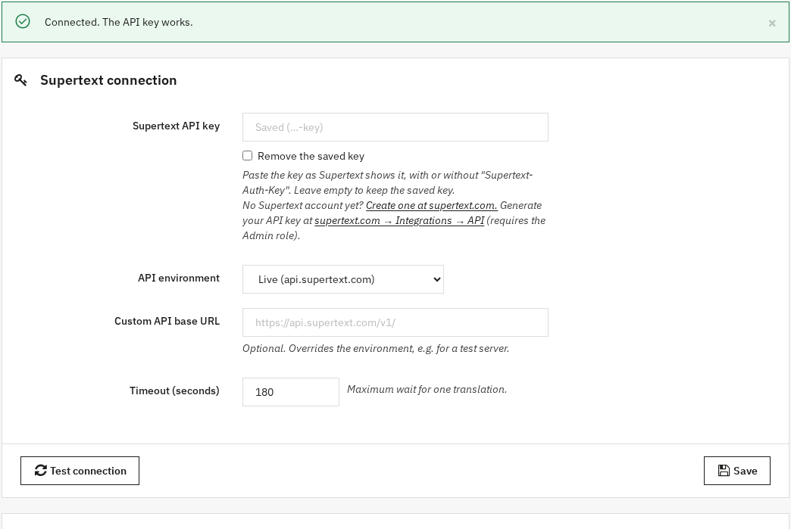
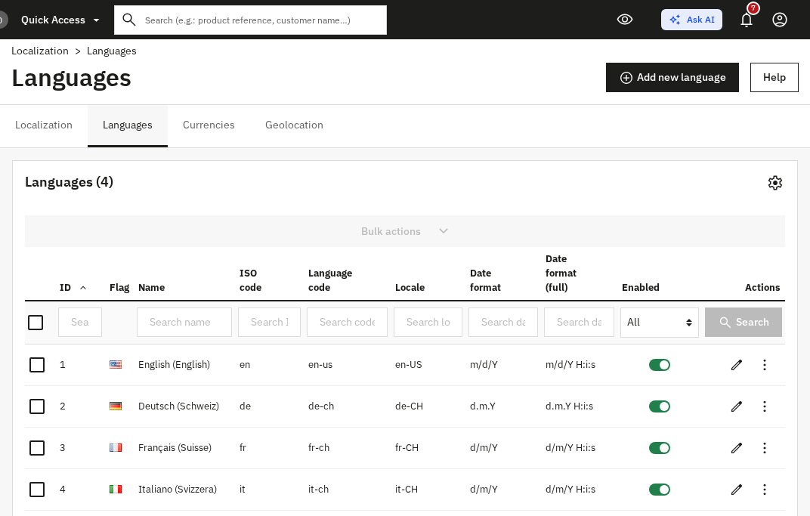
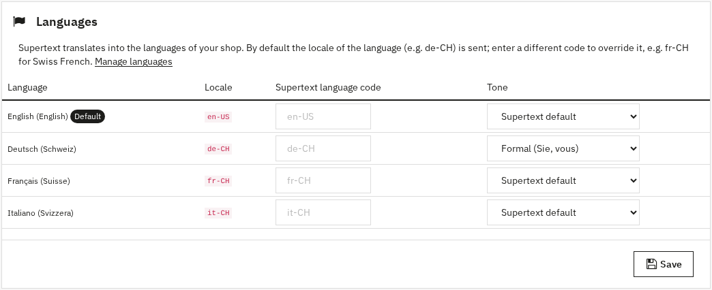

# Installation guide — Supertext Translation for PrestaShop

For administrators setting up the module in a PrestaShop shop.

## Just want to try it?

A ready-to-run container with PrestaShop 9, English sample products, a category and a CMS page, German (Switzerland), French (Switzerland) and Italian (Switzerland), and this module is in `demo/`. It is also what runs the public Supertext demo. See the *Demo* section of the [developer guide](DEVELOPER.md#demo-railway).

## Requirements

| | |
| --- | --- |
| PrestaShop | 9.x (tested with 9.2), 8.1 and 8.2 (supported, not yet tested) |
| PHP | 8.1 or later (whatever your PrestaShop version needs), with `ext-dom` and `ext-curl` (or `allow_url_fopen`) |
| Shop setup | At least two languages (step 3) |
| Supertext | An account with an API key, see [Get a Supertext account and API key](#get-a-supertext-account-and-api-key) |
| Network | The web server must reach `https://api.supertext.com` over HTTPS |

## 1. Install the module

The module isn't on PrestaShop Addons yet. Download `supertext-<version>.zip` from the [Releases page](https://github.com/Supertext/PrestaShop-Supertext-Translation/releases), or build it from this repository:

```bash
./build.sh            # creates dist/supertext-<version>.zip
```

Then in the back office: *Modules → Module Manager → Upload a module* and drop the zip. PrestaShop installs it right away. On the command line, unzip it into `modules/` and run:

```bash
php bin/console prestashop:module install supertext
```

## 2. Set the API key

### Get a Supertext account and API key

1. **Account:** no Supertext account yet? [Log in or create one](https://www.supertext.com/person/en/account/signin) with your email address.
2. **API key:** generate it at [supertext.com → Integrations → API](https://www.supertext.com/en/integrations/api). Only users with the **Admin** role in the Supertext account can do this; otherwise ask your Supertext account admin for a key.

The module settings link to both pages, next to the API key field.

### Enter it in PrestaShop

*Modules → Module Manager*, search for **Supertext Translation** and click **Configure**:

1. Paste your key into **Supertext API key** and click **Save**. You can paste it exactly as Supertext shows it, with the leading `Supertext-Auth-Key`, or without it. The field stays empty afterwards and shows the key's last characters; leave it empty to keep the saved key.
2. Click **Test connection**. *Connected. The API key works.* means everything is in place.



On servers you can set the key as the environment variable **`SUPERTEXT_API_KEY`** instead. It takes precedence over the field, keeps the key out of the database, and the settings page then says that the environment variable is used.

## 3. Set up the languages

The module translates into your shop's **languages**: every product, category and CMS page has its own name, descriptions and URL in each of them.

1. Add the languages you need: *International → Localization → Languages → Add new language*, or import a localization pack under *International → Localization*.
2. Make sure they are **enabled**, so customers see them.



When you add a language, PrestaShop copies the default language's texts into it. The module treats a text that is still identical to the source language as *not translated* and fills it.

### Language codes and tone

By default the language's **locale** (e.g. `de-CH`, `fr-CH`) is sent to Supertext as the target language. In the module settings' **Languages** panel you can, per language:

- send a **different code**, e.g. `fr-CH` for a language whose locale is `fr-FR`, and
- choose the **tone**: *Formal (Sie, vous)*, *Informal (du, tu)* or the Supertext default.



## 4. Check it works

Open *Catalog → Products*, tick a product and choose **Translate with Supertext** in the **Bulk actions** (see the [user guide](USER_GUIDE.md)). Or from the command line:

```bash
php bin/console supertext:translate product <id> [<id>…] [--to=de --to=fr] [--from=en] [--overwrite]
php bin/console supertext:translate category <id>
php bin/console supertext:translate cms <id>
```

## Who can translate

Employees whose profile may **edit** the item: *Catalog → Products* for products, *Catalog → Categories* for categories, *Design → Pages* for CMS pages (*Advanced Parameters → Team → Permissions*, "Edit"). PrestaShop's **Translator** profile can translate products and categories out of the box; give it *Design → Pages* (view and edit) if it should translate CMS pages too.

The **Translate with Supertext** button on the product page (*Modules* tab) is shown to profiles with **view** permission on the module. Installing the module grants it to every profile; you can change that under *Advanced Parameters → Team → Permissions → Modules*. Only SuperAdmins can configure the module.

## All settings

| Setting | Default | Purpose |
| --- | --- | --- |
| Supertext API key | – | Your key, with or without the `Supertext-Auth-Key` prefix. The `SUPERTEXT_API_KEY` environment variable wins. |
| API environment | Live | `Live` (api.supertext.com), `Staging` or `Testing` Supertext API |
| Custom API base URL | – | Overrides the environment (e.g. a test server). The `SUPERTEXT_API_ENDPOINT` environment variable wins. |
| Timeout | 180 s | Maximum wait for one translation (30–1800 s) |
| Languages | – | Per shop language: Supertext language code (default: the locale) and tone |

Settings are global (the same for all shops of a multistore installation).

## Updating

Upload the new zip in *Modules → Module Manager → Upload a module* (or replace `modules/supertext/` and run `php bin/console prestashop:module upgrade supertext`). Settings are kept.

## Uninstalling

*Modules → Module Manager*, **Supertext Translation** → **Uninstall**. This removes the module's settings; translations made so far stay in your shop.

## Troubleshooting

| Message | Cause / fix |
| --- | --- |
| *Supertext is not set up yet* | No API key: enter it in the module settings (step 2), or set `SUPERTEXT_API_KEY`. |
| *Authentication failed* | The key is wrong or revoked. Check it with **Test connection**; if needed, generate a new one at [supertext.com → Integrations → API](https://www.supertext.com/en/integrations/api) (Admin role required). |
| *You are not allowed to edit this item* | The employee's profile lacks *Edit* permission (see *Who can translate*). |
| *The translation could not be saved: …* | PrestaShop rejected a translated value (e.g. a field it validates strictly). The message names the field; translate it by hand or report it to Supertext. |
| *Too many requests to Supertext* | Supertext's per-second limit was still exceeded after 4 automatic retries. Wait a moment and translate again. |
| *Your Supertext translation limit is exceeded* | Your Supertext plan's volume is used up. |
| *Timed out waiting* | Very long descriptions: raise the *Timeout* (and PHP's `max_execution_time`). |
| *Could not reach Supertext* | The server can't make outbound HTTPS calls; check the firewall or proxy (`HTTPS_PROXY`). |
| No **Translate with Supertext** in the bulk actions | The module is disabled, or the list is a custom one. Clear the cache (*Advanced Parameters → Performance → Clear cache*). |
| No button in the product page's *Modules* tab | The employee's profile has no *view* permission on the module (see *Who can translate*). |

Failed translations are also written to *Advanced Parameters → Logs*.

## Security notes

- Prefer the `SUPERTEXT_API_KEY` environment variable on servers: the key then never sits in the database or its backups.
- The module only talks to the Supertext API you configured. Documents are deleted from Supertext right after download (and expire after 24 hours anyway).
