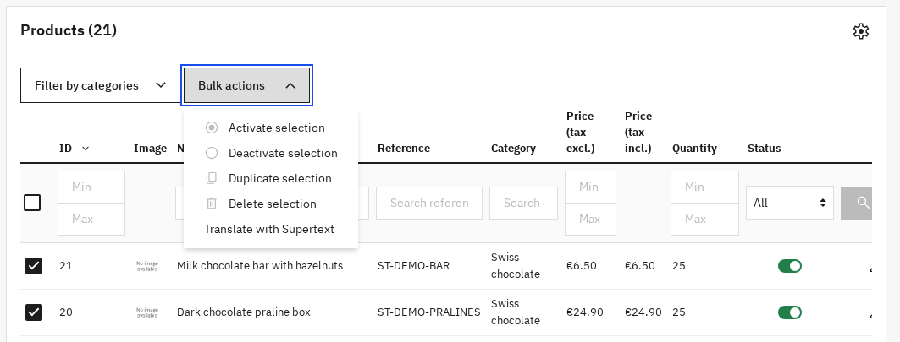
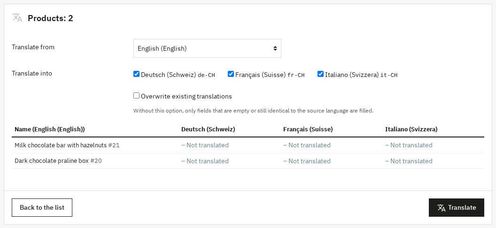
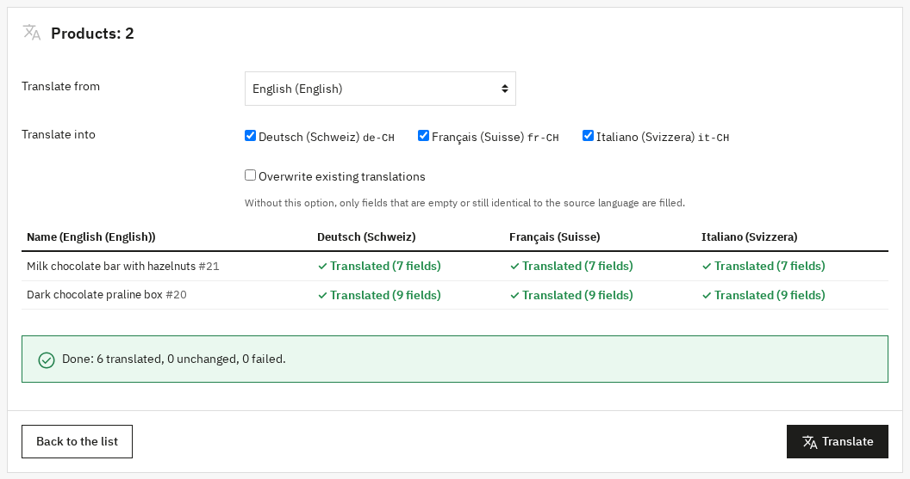
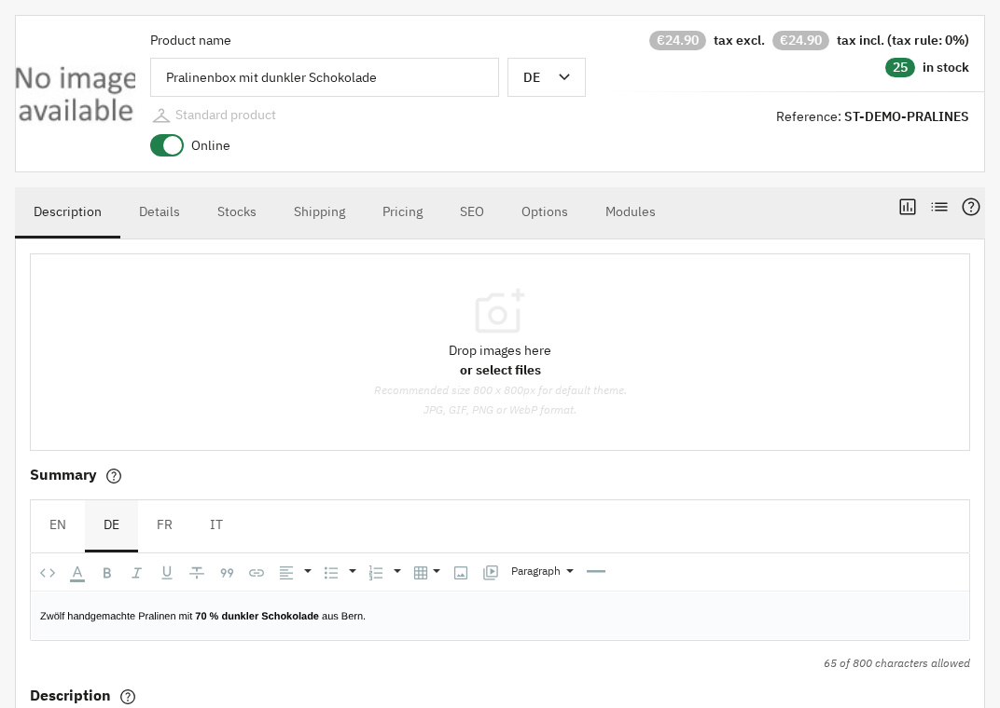
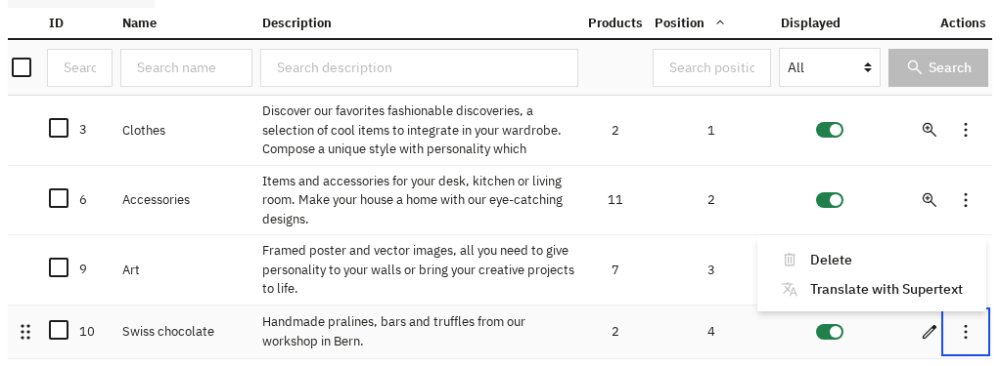
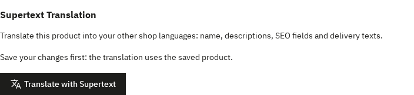
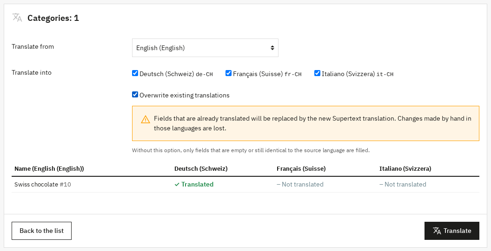

# User guide — Supertext Translation for PrestaShop

For shop editors. Once an administrator has set up the module (see [INSTALLATION.md](INSTALLATION.md)), you translate products, categories and CMS pages from the PrestaShop back office. Supertext writes the translation into the item's other languages; you review it like any other edit.

## Try it on the demo

The Supertext PrestaShop demo (ask Supertext for the address and a back-office login) has two English sample products, the category *Swiss chocolate* and the CMS page *Delivery and returns*, with German (Switzerland), French (Switzerland) and Italian (Switzerland) set up as languages. Translate them as described below, then switch the shop to another language.

## Translate products from the list

*Screenshots: PrestaShop 9.2 with the demo content.*

1. Open **Catalog → Products** and tick the product(s) you want to translate.
2. Open **Bulk actions** and choose **Translate with Supertext**.

   

3. The **Translate with Supertext** page lists the products with a column per language showing how far each is translated already. Choose the source language (*Translate from*, the shop's default language unless you change it) and tick the languages to translate into. All other languages are ticked.

   

4. Click **Translate**. Each product and language takes a few seconds; the table shows the result as it goes, and a summary when everything is done.

   

The translation is saved in the product's own fields for that language, straight away: open the product and switch the language next to the product name (or in the field's language tabs) to see it. The product's status doesn't change.

## Translate categories and CMS pages

**Catalog → Categories** and **Design → Pages** have the same **Translate with Supertext** bulk action. To translate a single item, you can also open the menu at the end of its row (⋮) and choose **Translate with Supertext**; it works the same way on the product list.

## Translate from the product page

On a product page, open the **Modules** tab and click **Configure** under *Supertext Translation*, then **Translate with Supertext**. It translates the **saved** product, so save your changes first.

## Existing translations

Without any option, the module only fills fields that are **empty or still identical to the source language** (PrestaShop copies the default language into new languages, so that is what an untranslated field looks like). Fields that already have their own translation are kept, and the page says so: *Translated (5 fields) · 2 kept*, or *Already translated, unchanged* when there was nothing left to do. The language columns show *Not translated*, *Partly translated* or *Translated* before you start.

To replace existing translations, tick **Overwrite existing translations**. The page warns you first: changes made by hand in those languages are lost.

## What is translated

| Item | Fields |
| --- | --- |
| Products | Name, summary, description, meta title, meta description, label when in stock, label when out of stock (back-orders allowed), delivery time of in-stock products, delivery time of out-of-stock products |
| Categories | Name, description, additional description, meta title, meta description |
| CMS pages | Title, meta title, meta description, page content |

- Rich text (summary, descriptions, page content) keeps its formatting, links and lists.
- The **friendly URL** follows the translated name (or the page title) while it is still the source language's URL, or when you overwrite. A friendly URL you set by hand is kept.
- **Not translated** (yet): tags, image captions, features and attribute values, combinations, attachments, customization fields, brands, suppliers, and the shop's theme and email texts (use *International → Translations* for those).

## Review

Open the item, switch to the language and read the fields; the translation is live as soon as the item is active in the shop. To check it in the shop, open the product, category or page there and switch the language.

## When something goes wrong

The table shows the reason for each item and language that fails; the other ones still run.

| Message | What to do |
| --- | --- |
| *Supertext is not set up yet* | An administrator needs to enter the API key in the module settings. |
| *You are not allowed to edit this item* | Your profile can't edit this kind of item; ask an administrator. |
| *Authentication failed* | The API key is no longer valid; tell your administrator. |
| *Too many requests to Supertext* | Wait a moment and click **Translate** again. Items already done show *Already translated, unchanged*. |
| *Your Supertext translation limit is exceeded* | Your Supertext plan's volume is used up; tell your administrator. |
| *The translation could not be saved: …* | PrestaShop rejected a translated value. Translate that field by hand. |
| *Timed out waiting for the Supertext translation* | Very long texts. Try again, or ask your administrator to raise the timeout. |
